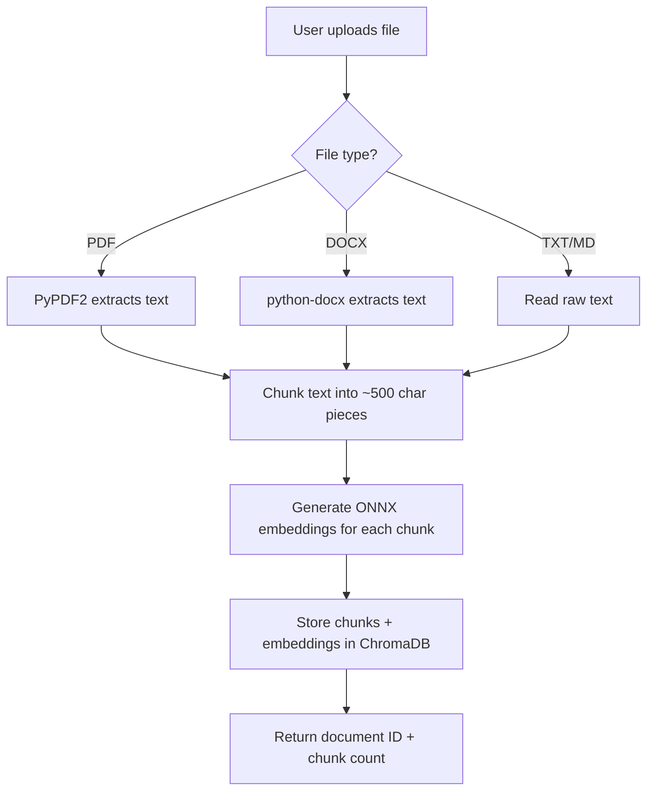
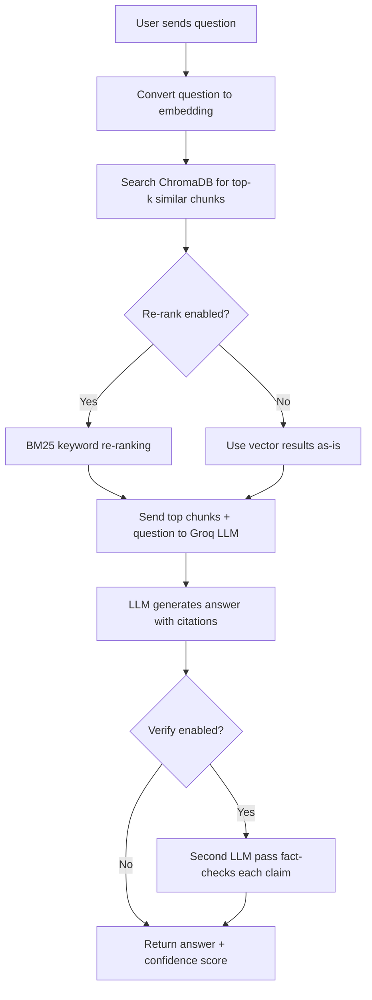

# AI RAG System

A **Retrieval-Augmented Generation** system built with Python, FastAPI, ChromaDB, and Groq LLM.

Upload your documents (PDF, DOCX, TXT, Markdown), ask questions in plain English, and get accurate answers **backed by citations from your own files** — not made-up info.

---

## How It Works (High-Level)

```mermaid
flowchart LR
    A[📄 Upload Document] --> B[✂️ Chunk Text]
    B --> C[🔢 Generate Embeddings]
    C --> D[💾 Store in ChromaDB]
    D --> E[❓ Ask a Question]
    E --> F[🔍 Search Similar Chunks]
    F --> G[🤖 LLM Generates Answer]
    G --> H[✅ Answer + Citations]
```



**In simple words:**

1. You upload a file → it gets split into small pieces (chunks)
2. Each chunk is converted into numbers (embeddings) that capture its meaning
3. When you ask a question, the system finds the most relevant chunks
4. Those chunks are sent to an LLM (Groq) which writes an answer using **only** your documents
5. Every claim in the answer includes a citation showing where it came from

---

## Document Upload & Ingestion Flow



---

## Query Flow



---

## Project Structure

```
ai-rag-system/
├── app/
│   ├── __init__.py            # FastAPI app setup (CORS, routes, lifespan)
│   ├── config/
│   │   ├── database.py        # ChromaDB settings
│   │   └── llm.py             # Groq API settings
│   ├── routes/
│   │   ├── documents.py       # Upload / list / delete documents
│   │   ├── query.py           # Ask questions
│   │   └── compare.py         # Compare two documents
│   ├── services/
│   │   ├── embeddings/
│   │   │   └── embedding_service.py   # ONNX embeddings (all-MiniLM-L6-v2)
│   │   ├── llm/
│   │   │   └── llm_service.py         # Groq chat completions
│   │   └── rag/
│   │       ├── rag_service.py         # RAG orchestrator
│   │       └── rerank_service.py      # BM25 keyword re-ranker
│   ├── vectorstore/
│   │   └── vector_store_service.py    # ChromaDB operations
│   └── utils/
│       ├── cache_service.py       # In-memory TTL cache
│       ├── chunking_service.py    # Text chunking logic
│       ├── document_parser.py     # File parsing (PDF/DOCX/TXT/MD)
│       ├── error_handler.py       # Custom exceptions
│       └── validators.py          # Request validation
├── main.py                # Entry point — starts the server
├── requirements.txt       # Python dependencies
├── .env                   # API keys & config (not committed)
└── README.md
```

---

## Features

| #   | Feature                | What it does                                                              |
| --- | ---------------------- | ------------------------------------------------------------------------- |
| 1   | **Document Upload**    | Upload PDF, DOCX, TXT, or Markdown files via API                          |
| 2   | **Smart Chunking**     | Splits text at sentence boundaries (~500 chars each, 100 char overlap)    |
| 3   | **Embeddings**         | Converts text to 384-dim vectors using ONNX (runs locally, no GPU needed) |
| 4   | **Vector Storage**     | Stores everything in ChromaDB with cosine similarity search               |
| 5   | **Query**              | Ask questions → get answers with per-claim citations                      |
| 6   | **Compare**            | Compare two documents side-by-side on any topic                           |
| 7   | **Structured Compare** | Get JSON output: similarities, differences, unique points                 |
| 8   | **Anti-Hallucination** | 3-layer strategy ensures answers come from your documents only            |

---

## Quick Start

### 1. Install dependencies

```bash
pip install -r requirements.txt
```

### 2. Set your API key

Create a `.env` file:

```env
GROQ_API_KEY=your_groq_api_key_here
PORT=3000
CHUNK_SIZE=500
CHUNK_OVERLAP=100
```

Get a free API key at [console.groq.com](https://console.groq.com)

### 3. Run the server

```bash
python main.py
```

Open **http://localhost:3000/docs** for the interactive Swagger UI.

---

## API Endpoints

| Method   | Endpoint                | Description                   |
| -------- | ----------------------- | ----------------------------- |
| `GET`    | `/health`               | Health check + stats          |
| `POST`   | `/api/documents/upload` | Upload a document (form-data) |
| `GET`    | `/api/documents`        | List all documents            |
| `GET`    | `/api/documents/stats`  | Document & chunk statistics   |
| `DELETE` | `/api/documents/{id}`   | Delete a document             |
| `POST`   | `/api/query`            | Ask a question                |
| `POST`   | `/api/compare`          | Compare two documents         |

### Example: Upload

```bash
curl -X POST http://localhost:3000/api/documents/upload \
  -F "file=@resume.pdf"
```

### Example: Query

```bash
curl -X POST http://localhost:3000/api/query \
  -H "Content-Type: application/json" \
  -d '{"query": "What skills does the candidate have?", "top_k": 5}'
```

### Example: Compare

```bash
curl -X POST http://localhost:3000/api/compare \
  -H "Content-Type: application/json" \
  -d '{"document_ids": ["id-1", "id-2"], "topic": "experience", "structured": true}'
```

---

## How Hallucination Reduction Works

```mermaid
flowchart TD
    A[User Question + Retrieved Chunks] --> B[Layer 1: Strict System Prompt]
    B --> C[Layer 2: Low Temperature 0.1]
    C --> D[Layer 3: Citation Enforcement]
    D --> E{Every claim cited?}
    E -->|Yes| F[✅ Trustworthy Answer]
    E -->|No| G[⚠️ Flagged as potential hallucination]
    F --> H{Verify flag on?}
    H -->|Yes| I[Second LLM pass fact-checks each claim]
    H -->|No| J[Return answer + confidence 1-10]
    I --> J
```



| Layer                | What it does                                                                                     |
| -------------------- | ------------------------------------------------------------------------------------------------ |
| **Strict Prompt**    | Tells the LLM: "Answer ONLY from the provided chunks. Say 'I cannot answer' if info is missing." |
| **Low Temperature**  | Set to 0.1 — makes output near-deterministic, reduces creative gap-filling                       |
| **Citations**        | Every claim must include `[Source: filename, Chunk N]` — uncited claims = red flag               |
| **Confidence Score** | 1-10 rating with reasoning. Below 5 = weak support in documents                                  |
| **Verification**     | Optional second LLM pass checks each claim against source chunks                                 |

---

## Tech Stack

| Component         | Technology              | Why                                              |
| ----------------- | ----------------------- | ------------------------------------------------ |
| **API Framework** | FastAPI                 | Fast, async, auto-generates Swagger docs         |
| **LLM**           | Groq (llama-3.3-70b)    | Free tier, fast inference, high quality          |
| **Embeddings**    | ONNX (all-MiniLM-L6-v2) | ~100MB RAM vs ~2GB for PyTorch — same quality    |
| **Vector DB**     | ChromaDB                | No separate server, persists to disk, easy setup |
| **Re-ranking**    | BM25                    | Keyword matching complements semantic search     |
| **Caching**       | In-memory TTL           | Embeddings 24h, queries 1h, documents 30min      |

---

## Environment Variables

| Variable          | Default | Description                           |
| ----------------- | ------- | ------------------------------------- |
| `GROQ_API_KEY`    | —       | Your Groq API key (required)          |
| `PORT`            | `3000`  | Server port                           |
| `CHUNK_SIZE`      | `500`   | Characters per chunk                  |
| `CHUNK_OVERLAP`   | `100`   | Overlap between chunks                |
| `LLM_TEMPERATURE` | `0.1`   | LLM creativity (lower = more factual) |
| `LLM_MAX_TOKENS`  | `2048`  | Max response length                   |

---
